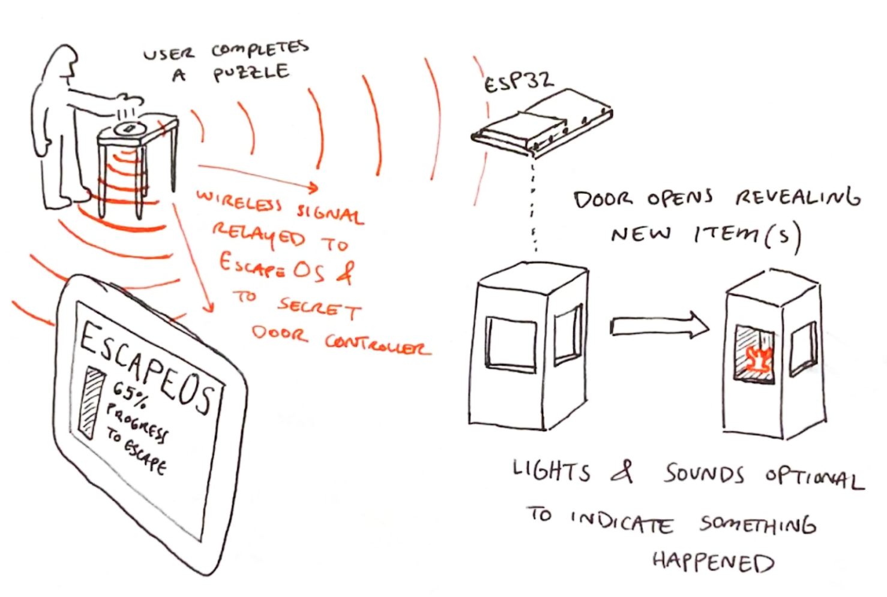
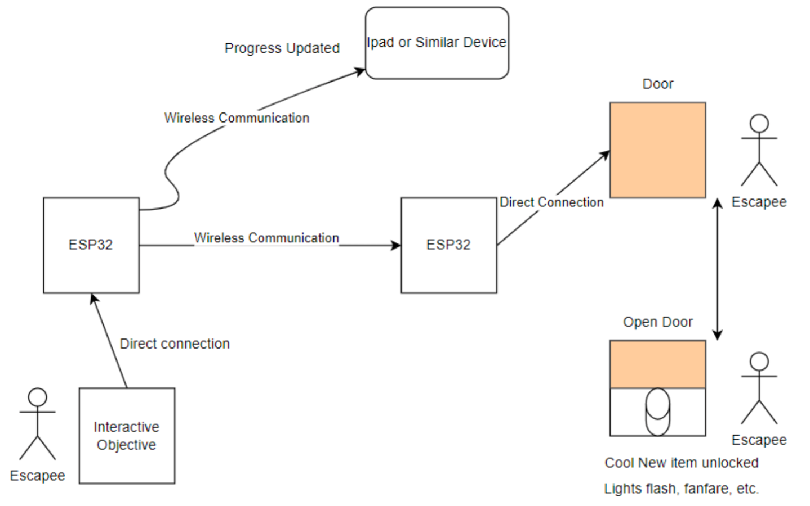

# Escape-Room-Wireless
What is our project:
We are designing hardware that interfaces with ESP32 and opens doors somewhere else in the room when players complete certain challenges in the escape room, and sends a notification to an iPad to keep track of progress. The puzzles are laid throughout the room on different podiums. 

Materials List:
Arduino Nano ESP32 (1 to control doors, 1 per puzzle step/group of steps)
Mahogany cabinet with sliding door
Servo motors (strong enough to withstand the force of players trying to pry open)

Basic Technologies:
ESP 32 & wireless communication
Motor (Servo?) control for secret doors

Questions that we have:
What power sources are available?
How will the doors know that the puzzle has been completed? Ideas:
An RFID totem that activates the door when scanned
ESP32 communication between the puzzle location and the door
Individual puzzles are wired to the door, with ESP32 communication to EscapeOS
Is the escapeOS program something that has been developed? Or is that a system that we are helping to develop?
Should servo work with gravity or not?
What ESP32 controller are we working with? Arduino, etc..
